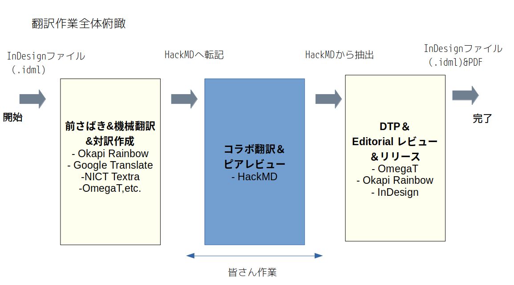

# Translation OSPO Paper 2021

This is Japanese translation of OSPO Report "[The Evolution of the Open Source Program Office (OSPO)](https://linuxfoundation.org/wp-content/uploads/LFResearch_OSPO_Report.pdf)" by TODO Groups(And The Linux Foundation)

Note: The pdf file in "PDF_final" folder IS NOT released version (almost though). the pdf here was reviewed by LF Japan and released [here](https://www.linuxfoundation.jp/resources/publications/the-evolution-of-the-open-source-program-office-ospo/) 

## Translated and reviewed by:
Shima, Noguchi, Mouri, and Taniguchi(Me)

## Supported by:
The Linux Foundation Japan

## Folders/Files

- **LFResearch_OSPO_Report Folder/LFResearch_OSPO_Report.pdf** 
This is the original english version, and our target file.

- **LFResearch_OSPO_Report Folder/PDF_final(Pre-release)** 
You can see pre-released PDF. (as noted above, this is not released version) 

- **LFResearch_OSPO_Report Folder/LFResearch_OSPO_Report.indd** 
Adobe InDesign file we edit this. 

- **LFResearch_OSPO_Report Folder/omegaT_Rainbow** 
This is the translation memory data, which can be (re-)used for another translations or machine learning. 

## About the LFJ Collaborative Translation Effort (CTE) 

__"How translation works can be more effective, efficient and ENJOYABLE in COLLABORATIVE manner? "__
This is a big challenge about translation, and is also a notion that **native authors don't care**. Our effortrs focus on this. And this output here is also a a case study of such such efforts, based on a process like below. 

s

